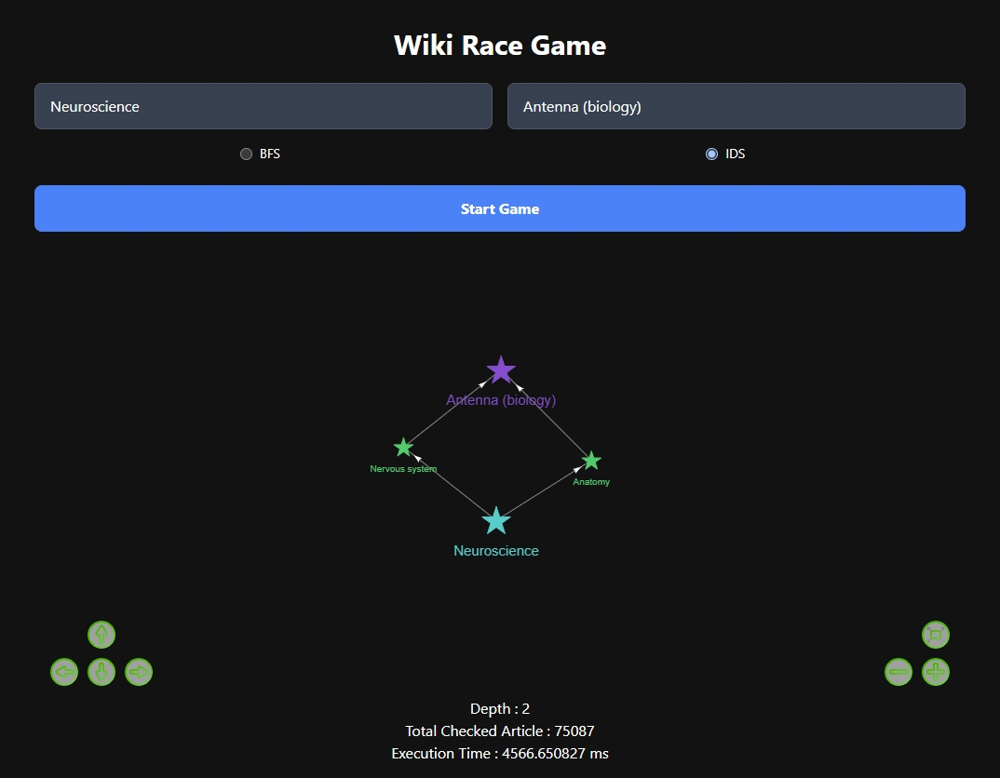
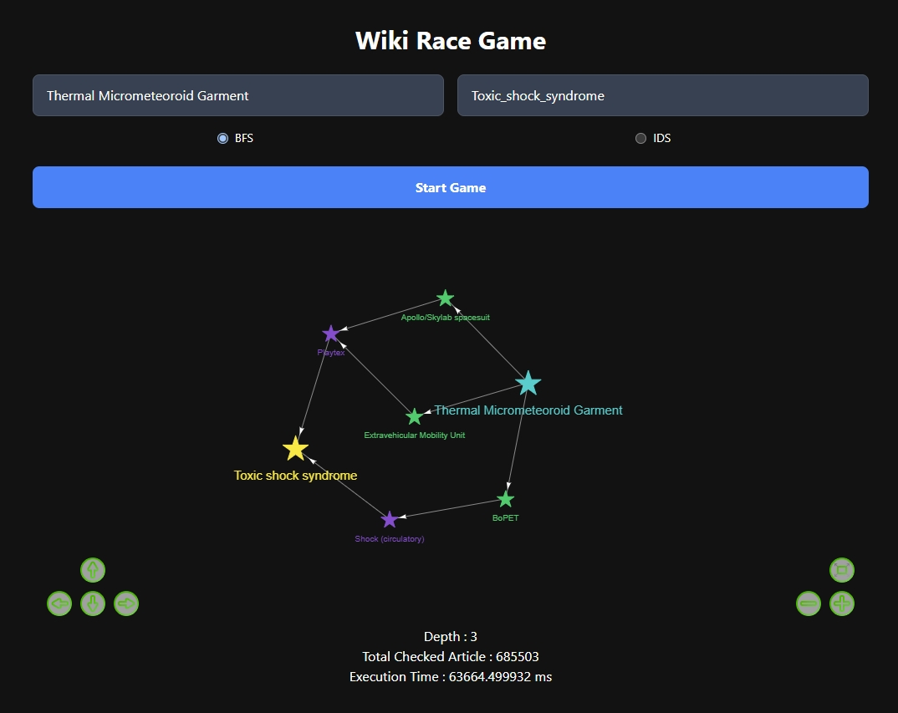

# Tugas Besar 2 IF 2211 Strategi Algoritma
> Karunia Syukur Baeha - 10023478
>
> Ahmad Hasan Albana - 13522041
>
> Steven Tjhia - 13522103
>

## Table of Contents
* [General Info](#general-information)
* [Technologies Used](#technologies-used)
* [Features](#features)
* [Screenshots](#screenshots)
* [Setup](#setup)
* [Usage](#usage)
* [Project Status](#project-status)
* [Room for Improvement](#room-for-improvement)

## General Information
- This project aims to solve the _Cyberpunk 2077 Breach Protocol_ minigame by _Brute Force_ Algorithm. The minigame simulates hacking on local network from _ICE (Intrusion Countermeasures Electronics)_ on _Cyberpunk 2077_.

## Technologies Used
- Go - version 1.22.1
- React - version 18.2.0
- Tailwind CSS - version 3.4.3
- React-vis-network-graph - version 3.0.1 

## Features
- Input(s) validation
- Algorithm choice (BFS/IDS)
- Graph vizualization
- Multiple Solution
- Node coloring : different depth -> different color
- Redirect link handling

## GUI Screenshots

## Setup

### Docker

1. Install Docker Desktop

2. Open Docker Desktop

### Frontend

1. From Tubes2_AnaxaGOras directory, navigate to "frontend" directory

    `cd src/frontend`

2. Build frontend docker image

    `docker build -t anaxagoras_fe .`

3. Run frontend docker image

    `docker run -p 3000:3000 anaxagoras_fe`

4. Use darkmode on device for better experience

### Backend

1. From Tubes2_AnaxaGOras directory, navigate to "frontend" directory

    `cd src/backend`

2. Build backend docker image

    `docker build -t anaxagoras_be .`

3. Run backend docker image

    `docker run -p 8000:8000 anaxagoras_be` 

## Usage
1. Fill the Start Page and Target Page field
2. Choose algorithm
3. Press "Start Game" Button

## Project Status
Project is: _complete_.

## Room for Improvement
- Auto-complete for Start Page and Target Page field using Wikipedia API.
